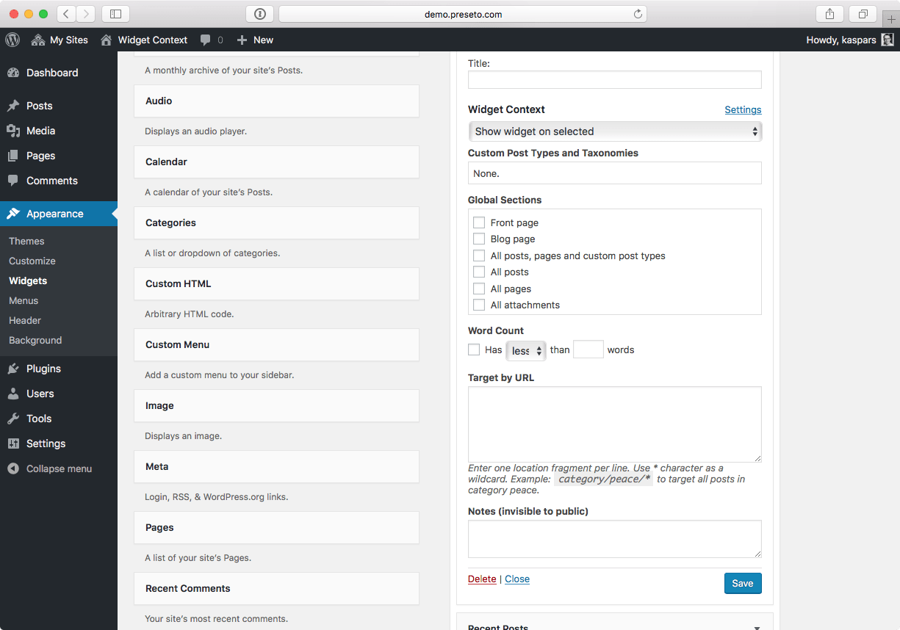

# Widget Context

Source of the [Widget Context plugin](https://widgetcontext.com) for WordPress.

## Start Contributing

1. Clone the plugin repository:

	   $ git clone https://github.com/kasparsd/widget-context-wporg.git
	   $ cd widget-context-wporg

2. Setup the development environment and tools:

	   $ composer install

## Screenshots

